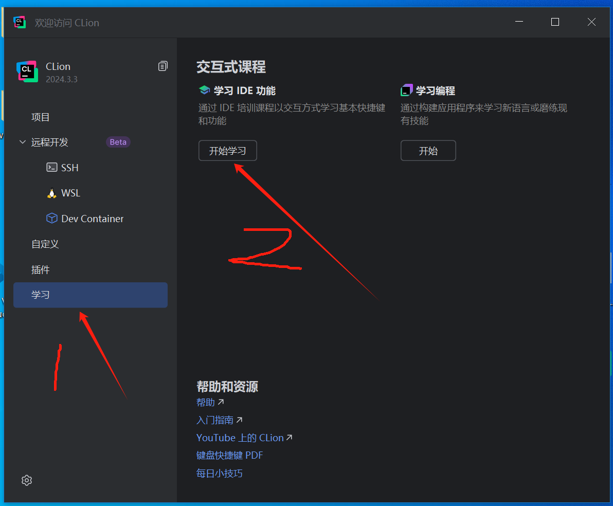
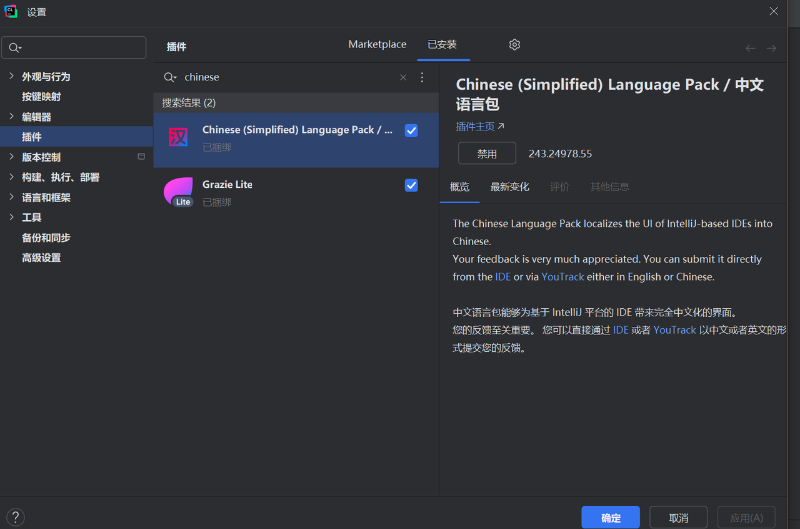
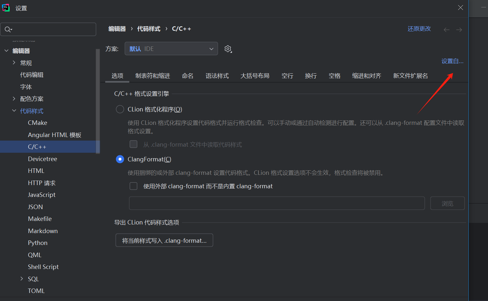

# 1. 下载地址

- 官网：`https://www.jetbrains.com/clion/download/#section=windows`

# 2. 学习教程

## 2.1 官网教程

- 地址：`https://www.jetbrains.com/clion/learn/`

## 2.2 IDE教程

- 启动后，可以在主页面找到学习ide的按钮

# 3. 基础配置

## 3.1 汉化

- 在设置->插件->搜索Chinese找到语言包，随后根据提示重启即可

## 3.2 代码风格

- 设置->编辑器->代码样式->C/C++，选择预设的代码风格模板。

# 4. 常用快捷键

## 4.1 window按键映射

  - `Ctrl + Alt + L` 格式化代码，处理缩进和换行问题
  - `ALt + Enter` 弹出当前位置的可改进建议
  - `Ctrl+ W` 从光标位置开始向外选中，可重复按下以扩大选中范围
  - `Ctrl + Shift + W` 将选中范围缩小至函数的实参
  - `Shift + Shift` 快速打开搜索
  - `Ctrl + /` 快速行注释或取消行注释
  - `Ctrl + Shift + /` 快速块注释或取消块注释
  - `Ctrl + Alt + L` 快速包裹代码块
  - `Ctrl + D` 复制当前行
  - `Ctrl + Y` 删除当前行
  - `Alt + Shift + ↑` 向上移动当前行
  - `Ctrl + Shift + ↑` 向上移动当前函数方法的整个定义
  - `Alt + J` 快速选中当前符号
  - `Ctrl + Alt + Shift + J` 选中全部当前同名字符，选了`ca` 那么 `cat`中的`ca`也会被选中
  - `Shift + F6` 快速重命名全局符号
  - `Ctrl + F6` 快速修改函数签名
  - `Ctrl + Shift + F` 搜索
  - `Ctrl + Shift + R` 替换
  - `Ctrl + Q` 查看光标处内容的文档
  - `Ctrl + F12` 查看结构
  - `Ctrl + 空格` 激活基础补全
  - `Ctrl + Shift + 空格` 查看补全推荐项
  - `Ctrl + Shift + Enter` 补全语句
  - `Shift + F10` 运行
  - `Shift + F9` 调试
  - `Ctrl + F8` 断点
  - `Ctrl + F5` 完成
  - `F7` 进入函数，下一步
  - `F8` 不进入函数，下一步
  - `F9` 继续执行