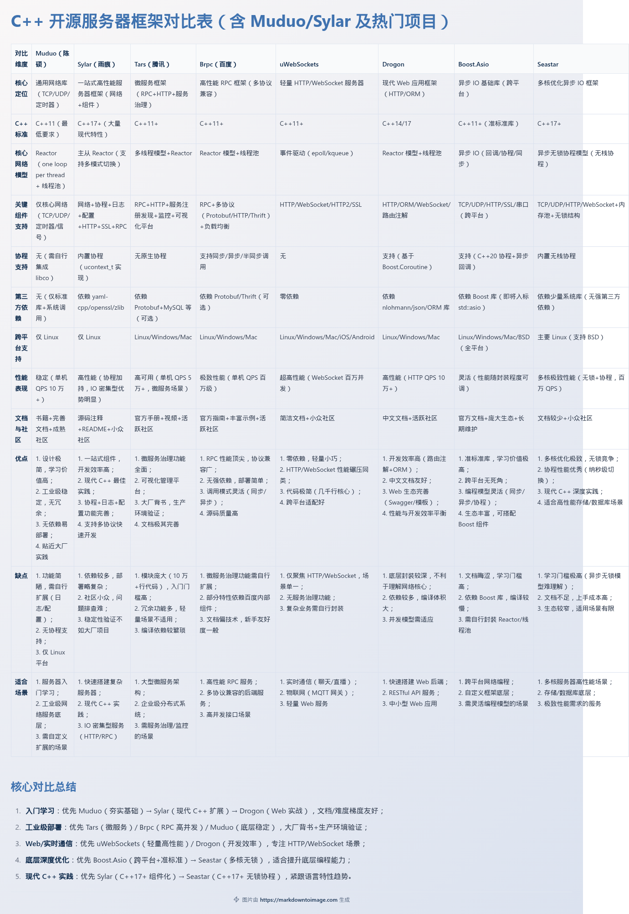

- 除了 Muduo 和 Sylar，C++ 还有很多优秀的开源服务器项目，覆盖 **不同场景（HTTP、RPC、游戏、通用网络）、不同技术栈（传统多线程、协程、异步 IO）**
## 一、入门友好型（适合新手进阶，难度低于 Sylar）
### 1. Tars（腾讯开源） 
- **项目地址**：https://github.com/Tencent/Tars 
- **核心定位**：一站式微服务框架（支持 RPC、HTTP、消息队列等），腾讯内部大规模使用（QQ、微信、腾讯视频等）。 
- **技术栈**：C++11+、Protobuf 协议、多线程模型、服务注册发现、负载均衡、监控告警。 
- **亮点**： 
	- 文档极其完善（有官方手册、视频教程、实战案例），社区活跃； 
	- 开箱即用，支持快速搭建微服务（比如 RPC 服务、HTTP 网关）；
	- 自带可视化管理平台（服务部署、监控、灰度发布），降低运维成本。
-  **学习价值**：适合了解「微服务架构」「RPC 协议设计」「工业级服务治理」，腾讯背书，稳定性有保障，就业场景匹配度高。 - **缺点**：模块较多（核心代码约 10 万行），初期需聚焦 RPC 核心模块学习，避免冗余。 
- 
### 2. Brpc（百度开源） 
- **项目地址**：https://github.com/apache/brpc 
- **核心定位**：高性能 RPC 框架（支持 HTTP、RESTful、Protobuf、Thrift 等协议），百度内部用于搜索、地图等核心业务。 
- **技术栈**：C++11+、Reactor 模型、线程池、多种序列化协议（Protobuf/Thrift）、负载均衡。 
- **亮点**： 
	- 性能极强（单机 QPS 可达百万级），支持同步/异步/半同步调用； 
	- 文档详细（官方指南+源码注释），示例丰富（HTTP 服务器、RPC 客户端/服务端）； 
	- 无强依赖（仅依赖 Protobuf 等基础库），编译部署简单。 
- **学习价值**：适合深入理解「高性能 RPC 实现」「多协议兼容」「网络请求优化」（比如连接复用、超时重试），工业级实践价值高。 
- **缺点**：微服务治理功能（如服务注册发现）需搭配百度内部组件，外部使用需自行扩展。 

### 3. uWebSockets（轻量 HTTP/WebSocket 服务器） 
- **项目地址**：https://github.com/uNetworking/uWebSockets 
- **核心定位**：超轻量、高性能的 HTTP/WebSocket 服务器（支持 HTTP/2、SSL），适合实时通信场景（聊天、直播、物联网）。 
- **技术栈**：C++11+、事件驱动（epoll/kqueue）、零依赖（仅依赖系统调用）。 
- **亮点**： 
	- 代码极简（核心代码仅几千行），内存占用低（比 Nginx 更轻）； 
	- 性能碾压同类框架（WebSocket 并发连接数可达百万级）； 
	- 支持 Node.js 绑定，也可纯 C++ 开发。 
- **学习价值**：适合新手学习「HTTP 协议解析」「WebSocket 握手/帧处理」「轻量级事件驱动模型」，入门门槛低，实战性强。 - **缺点**：仅聚焦 HTTP/WebSocket，无 RPC、服务治理等功能，适用场景单一。 

## 二、进阶提升型（适合有基础，想深入底层） 

### 1. Seastar（高性能异步 IO 框架） 
- **项目地址**：https://github.com/scylladb/seastar 
- **核心定位**：基于「共享内存无锁」的异步 IO 框架，专为多核服务器优化（ScyllaDB 数据库的底层依赖）。 
- **技术栈**：C++17+、协程（无栈协程）、异步 IO、无锁编程、内存池。 
- **亮点**： 
	- 极致性能（充分利用多核，避免锁竞争和上下文切换）；
	- 现代 C++ 实践（无栈协程、异步编程模型、模板元编程）； 
	- 支持 TCP/UDP/HTTP/WebSocket 等协议，可扩展能力强。 
- **学习价值**：适合深入理解「多核编程优化」「无锁数据结构」「异步协程模型」，技术深度高，能提升底层编程能力。
- **缺点**：学习门槛极高（异步编程模型较难理解），文档较少，适合有一定 C++ 并发编程基础的开发者。 

### 2. Drogon（高性能 HTTP 应用框架） 
- **项目地址**：https://github.com/drogonframework/drogon 
- **核心定位**：基于 C++14/17 的高性能 HTTP 应用框架，支持 RESTful API、WebSocket、ORM、模板引擎等，适合快速搭建 Web 服务。 
- **技术栈**：C++14+、Reactor 模型、线程池、ORM（支持 MySQL/PostgreSQL）、JSON 序列化（集成 nlohmann/json）。 
- **亮点**： 
	- 开发效率高（支持路由注解、依赖注入），自带 ORM 无需手动写 SQL； 
	- 性能优秀（HTTP QPS 可达 10 万+），支持插件扩展； 
	- 文档完善（多语言支持，含中文文档），社区活跃。 
	- - **学习价值**：适合学习「现代 C++ Web 开发」「ORM 框架设计」「路由匹配算法」，能衔接实际业务开发（比如快速搭建后端 API）。 
- **缺点**：依赖较多（需安装 ORM、JSON 等库），底层封装较深，不利于理解网络核心原理。 

### 3. Boost.Asio（准标准库级异步 IO 库） 
- **项目地址**：https://www.boost.org/doc/libs/release/libs/asio/ 
- **核心定位**：Boost 库中的异步 IO 组件（即将纳入 C++23 标准库，命名为 `std::asio`），是很多C++ 服务器框架的底层依赖（如 Muduo 早期参考了 Asio 的设计）。 
- **技术栈**：C++11+、异步 IO、回调/协程模型、跨平台（Linux/Windows/Mac）。 
- **亮点**：
	- 接口优雅，支持同步/异步/协程三种编程模型； - 跨平台兼容性强（无需关心底层 epoll/kqueue/IOCP）；
	- 生态丰富（支持 TCP/UDP/HTTP/SSL 等，可搭配 Boost 其他组件）。 
- **学习价值**：适合深入理解「异步 IO 底层实现」「跨平台网络编程」「标准库级别的接口设计」，是 C++ 网络编程的“基础库”，学会后能触类旁通很多框架。 
-  **缺点**：文档较晦涩（需要一定 Boost 基础），纯库而非框架，需自行封装 Reactor、线程池等组件。 

## 三、小众但有特色（适合特定场景学习）

### 1. Oat++（轻量 Web 框架） 
- - **项目地址**：https://github.com/oatpp/oatpp 
- - **核心定位**：零依赖、轻量级的 Web 框架（支持 HTTP/2、WebSocket、ORM），适合嵌入式或资源受限场景。
- - **亮点**：
		- 纯 C++ 实现，无第三方依赖，编译后体积小；
		- 支持 RESTful API、Swagger 文档自动生成。 
- - **学习价值**：适合学习「轻量级框架设计」「无依赖组件封装」，入门门槛低。 

### 2. Photon（字节跳动开源） 
- **项目地址**：https://github.com/alibaba/Photon 
- **核心定位**：高性能、轻量级的异步运行时（支持协程、异步 IO、无锁编程），字节跳动用于存储、数据库等场景。 
- **亮点**：协程切换开销低（纳秒级），支持多线程/多进程模型，兼容 POSIX 接口。 
- **学习价值**：适合了解大厂内部的「高性能运行时设计」「协程与异步 IO 结合」，技术前瞻性强。 

### 3. ACE（传统工业级框架） 
- **项目地址**：https://github.com/DOCGroup/ACE_TAO 
- **核心定位**：老牌工业级网络编程框架（诞生于 90 年代），支持跨平台、多线程、分布式系统。 
- **亮点**：组件丰富（线程池、定时器、消息队列等），经过长期生产环境验证。 
- **学习价值**：适合了解「传统 C++ 服务器框架设计」，但代码风格偏老（C++98），学习门槛高，现在较少用于新项目。 

## 四、选型&学习建议（按场景匹配） 
### 1. 想入门 Web/HTTP 服务器 → 优先 uWebSockets / Drogon - uWebSockets：轻量、极简，适合理解 HTTP/WebSocket 核心原理； - Drogon：功能全面，开发效率高，适合快速搭建实际 Web 服务。 
### 2. 想学习 RPC/微服务 → 优先 Tars / Brpc - Tars：文档全、生态完善，适合系统学习微服务治理； - Brpc：性能强、协议兼容广，适合深入 RPC 底层实现。 
### 3. 想提升底层编程能力 → 优先 Boost.Asio / Seastar - Boost.Asio：准标准库，学习价值高，适配所有网络编程场景； - Seastar：极致性能，适合理解多核优化、无锁编程。 
### 4. 想适配大厂技术栈 → 优先 Tars（腾讯）/ Brpc（百度）/ Photon（字节） 这些项目是大厂内部验证过的工业级框架，技术栈与就业场景匹配度高，简历上有相关经验加分。 
### 5. 学习路径建议（衔接 Muduo/Sylar 之后） 
1. 入门阶段（Muduo/Sylar 之后）：uWebSockets → Drogon（掌握 Web 服务开发）； 
2. 进阶阶段：Brpc → Tars（理解 RPC/微服务）； 
3. 深入阶段：Boost.Asio → Seastar（夯实底层异步 IO/多核优化）。 

## 总结 C++ 开源服务器项目的选择，核心看你的 **学习目标和应用场景**： 
- 新手进阶：优先 uWebSockets、Drogon（易上手、实战性强）； 
- 工业级应用：优先 Tars、Brpc（大厂背书、稳定性有保障）； 
- 底层深度：优先 Boost.Asio、Seastar（提升核心编程能力）。 
- 无论选择哪个项目，学习时都要遵循「先跑通示例→理解核心模块→动手实战」的逻辑，重点关注「网络模型（Reactor/协程）、协议解析、性能优化」这三个核心点。

