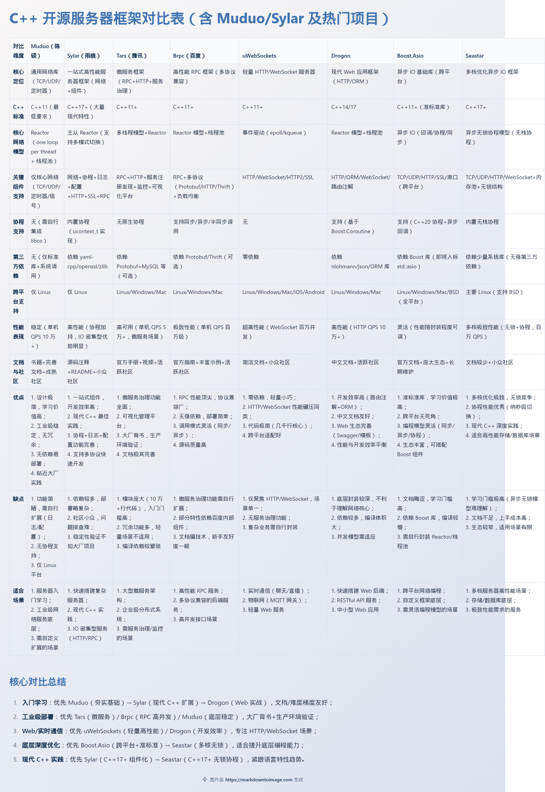

# 1. 服务器开源项目对比

除 Muduo / Sylar 外，C++ 服务器与 RPC 框架按场景与难度的选型索引。

## 【核心精简提纲】

### 记忆主干

**入门 HTTP/WebSocket** → uWebSockets / Drogon；**RPC 微服务** → Tars / Brpc；**底层异步 IO** → Boost.Asio / Seastar。**先看网络模型（Reactor/协程），再选框架**。

### 核心要点清单

- **Tars**（腾讯）：微服务全家桶，文档全，代码量大（~10 万行），先攻 RPC 核心
- **Brpc**（百度/Apache）：高性能 RPC，百万 QPS 级，服务发现需自行扩展
- **uWebSockets**：极简 epoll/kqueue，WebSocket 并发高，场景单一
- **Seastar**（ScyllaDB）：共享无锁 + C++17 协程，门槛极高
- **Drogon**：REST + ORM，开发效率高，底层封装深
- **Boost.Asio**：准标准库级异步 IO，需自封装 Reactor

### 选型速查

| 目标 | 优先 |
|------|------|
| 入门 HTTP/WS | uWebSockets → Drogon |
| RPC / 微服务 | Tars → Brpc |
| 底层能力 | Boost.Asio → Seastar |
| 简历 / 大厂栈 | Tars / Brpc / Photon |

### 交叉引用

- [[C-Linux生态/05.网络编程/1. muduo-linux服务器|muduo 网络编程]]
- [[C-Linux生态/06.开源项目分析/1. 开源项目分析|开源项目分析总览]]

## 【完整拓展详情】

## 1.1 入门友好型

### 1.1.1 Tars（腾讯）

- 地址：<https://github.com/Tencent/Tars>
- 定位：RPC、HTTP、消息队列一站式微服务；QQ/微信内部验证
- 栈：C++11+、Protobuf、多线程、注册发现、监控告警
- 亮点：文档/视频/管理平台齐全，开箱即用
- 学习：聚焦 RPC 与服务治理，勿一开始通读全库
- 缺点：模块多，初期易迷失

### 1.1.2 Brpc（百度 / Apache）

- 地址：<https://github.com/apache/brpc>
- 定位：高性能 RPC，HTTP/REST/Protobuf/Thrift
- 亮点：单机 QPS 极高，同步/异步/半同步；依赖少
- 缺点：治理组件偏百度内部生态，外部需自建注册中心

### 1.1.3 uWebSockets

- 地址：<https://github.com/uNetworking/uWebSockets>
- 定位：轻量 HTTP/WebSocket/HTTP2/SSL，实时通信
- 亮点：核心仅数千行，零依赖，WebSocket 并发极强
- 缺点：无 RPC/治理，场景窄

## 1.2 进阶提升型

### 1.2.1 Seastar

- 地址：<https://github.com/scylladb/seastar>
- 定位：多核共享内存无锁异步框架（ScyllaDB 底层）
- 栈：C++17 无栈协程、内存池
- 亮点：极致多核利用，现代 C++ 异步模型
- 缺点：文档少，异步模型陡峭

### 1.2.2 Drogon

- 地址：<https://github.com/drogonframework/drogon>
- 定位：HTTP 应用框架，REST/WebSocket/ORM/模板
- 亮点：路由注解、ORM、中文文档、QPS 10 万+
- 缺点：依赖多，不利于啃底层 epoll

### 1.2.3 Boost.Asio

- 地址：<https://www.boost.org/doc/libs/release/libs/asio/>
- 定位：跨平台异步 IO（C++23 方向 `std::execution` 生态参考）
- 亮点：同步/异步/协程三模；Linux epoll / Windows IOCP 统一
- 缺点：文档晦涩，纯库非框架，Reactor 需自搭

## 1.3 小众特色

| 项目 | 特点 |
|------|------|
| **Oat++** | 零依赖 Web/ORM，嵌入式友好 |
| **Photon**（字节） | 纳秒级协程切换，存储/DB 场景 |
| **ACE** | 90 年代工业框架，C++98 风格，新项目少见 |

## 1.4 学习路径（Muduo/Sylar 之后）

1. **入门**：uWebSockets → Drogon（Web 实战）
2. **进阶**：Brpc → Tars（RPC/微服务）
3. **深入**：Boost.Asio → Seastar（异步 IO / 多核）

### 踩坑

- 不要「框架全家桶」式通读：先跑通官方 example，再盯 `EventLoop`/协议解析/线程模型三件套
- Tars/Brpc 编译链长，Docker 或官方脚本比手工 cmake 省事
- 简历写「读过 muduo」不如「用 uWS 写通过 WS 压测的 demo」有说服力

## 1.5 总结

| 人群 | 推荐 |
|------|------|
| 新手进阶 | uWebSockets、Drogon |
| 工业落地 | Tars、Brpc |
| 底层深度 | Boost.Asio、Seastar |

学习节奏：**跑通示例 → 读核心模块 → 做小实战**；重点关注 Reactor/协程、协议解析、性能优化。
