# 1. DOT 与 PlantUML 绘图

## 【核心精简提纲】

### 记忆主干

用 **文本即图（diagram as code）** 维护架构图与流程图：依赖拓扑、调用关系优先 Graphviz **DOT**；时序、类结构、组件/部署、状态机优先 **PlantUML**。源文件进 Git，渲染产物进 `picture/` 或由编辑器实时预览。

### 核心要点清单

- **选型**：结构/依赖/拓扑 → DOT；行为/交互/UML 标准图 → PlantUML
- **DOT 核心**：`digraph` 有向、`graph` 无向；边用 `->` / `--`；`rankdir`、`subgraph cluster_*` 控制布局
- **PlantUML 核心**：`@startuml` … `@enduml`；图类型由关键字决定（`participant`、`class`、`component`、`[*]` 等）
- **Obsidian**：装 PlantUML / Graphviz 预览插件；或 CLI 导出 PNG 后用 ``
- **规范**：一图一源文件；节点 ID 稳定；中文可用，复杂布局优先英文 ID + `label`

### 学习路径

1. 用 DOT 画一张模块依赖 `digraph`
2. 用 PlantUML 画一张请求时序图
3. 再补组件图 / 状态图各一张，形成「架构三件套」
4. 对照 [[D-系统与架构/02.软件架构设计/2. 结构化设计|结构化设计]] 中的依赖可视化用法

### 关键结论 / 流程

```plain
画什么？
  依赖 / 调用 / 数据流拓扑     → DOT（Graphviz）
  时序 / 类 / 组件 / 状态 / 部署 → PlantUML
落盘？
  源码 .dot / .puml → vault 或项目 docs/
  需要静态图时 → PNG → picture/
```

## 【完整拓展详情】

知识库与项目设计里，手动画图难 diff、难评审。**DOT**（Graphviz）与 **PlantUML** 都是「源码渲染成图」：改文本即可改图，适合长期演进的架构文档。

| 维度 | DOT（Graphviz） | PlantUML |
|------|-----------------|----------|
| 强项 | 图论布局：依赖、调用、拓扑 | UML/工程图：时序、类、组件、状态 |
| 语法 | `digraph` / `graph` + 边 | `@startuml` + 图类型关键字 |
| 布局 | 引擎自动排（`dot`/`neato`/`fdp`…） | 多数图类型自带语义布局 |
| 典型输出 | PNG / SVG / PDF | PNG / SVG / ASCII / PDF |
| 本库关联 | 结构化设计中的依赖可视化 | 本笔记 |

> 表格内勿写带别名的 wikilink；可点链接见文末「相关笔记」。

## 1.1 环境与工作流

### 1.1.1 本地 CLI

```bash
# Graphviz（提供 dot 命令）
# Windows: winget install graphviz  或  choco install graphviz
dot -Tpng deps.dot -o picture/deps.png
dot -Tsvg deps.dot -o picture/deps.svg

# PlantUML（需 Java；或用官方 Docker / VS Code 插件内置）
plantuml -tpng sequence.puml -o picture/
# 或
java -jar plantuml.jar -tpng sequence.puml
```

### 1.1.2 Obsidian / IDE

| 场景 | 建议 |
|------|------|
| 笔记内实时预览 | Obsidian：PlantUML 插件；Graphviz/Dot 插件（或 Embed） |
| VS Code / Cursor | PlantUML 扩展 + Graphviz Preview |
| 对外发布 / README | CLI 导出 PNG，笔记内 `` |

### 1.1.3 推荐目录习惯

```plain
docs/diagrams/          # 或 vault 旁项目内
  architecture.dot      # 模块依赖
  request-flow.puml     # 请求时序
  deploy.puml           # 部署
picture/                # 需要嵌入笔记的静态导出
  architecture.png
```

原则：**源文件可版本管理；PNG 是渲染缓存**。评审看 `.dot`/`.puml` 的 diff，比看截图清晰。

## 1.2 何时用 DOT，何时用 PlantUML

| 图意图 | 优先 | 说明 |
|--------|------|------|
| 模块 / 包依赖 | DOT | `digraph` + 边权重/颜色标违规依赖 |
| 函数调用拓扑 | DOT | 从 cscope/Doxygen 生成 `.dot` 再手工精修 |
| 数据流 / 流水线 | DOT 或 PlantUML activity | 节点少用 DOT 更干净；分支多可用 activity |
| 请求时序（谁调谁、先后） | PlantUML sequence | DOT 画时序很别扭 |
| 类 / 接口关系 | PlantUML class | 继承、实现、组合语义清晰 |
| 组件 / 分层架构 | PlantUML component | `package` / `component` / 接口球窝 |
| 状态机 | PlantUML state | `[*]` 起止、`-->` 迁移 |
| 部署（节点、容器、进程） | PlantUML deployment | `node` / `artifact` |
| 用例 | PlantUML usecase | 角色与系统边界 |

经验法则：**「点与边」用 DOT；「UML 语义」用 PlantUML。**

## 1.3 DOT 基础与常用图

### 1.3.1 最小有向图

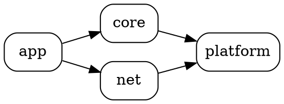

```bash
dot -Tpng module_deps.dot -o picture/module_deps.png
```

### 1.3.2 分层架构（cluster）

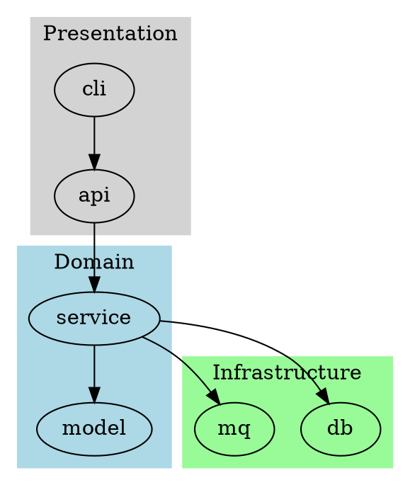

要点：`subgraph cluster_名字` 的名字必须以 `cluster_` 开头，Graphviz 才会画框。

### 1.3.3 调用 / 依赖违规高亮

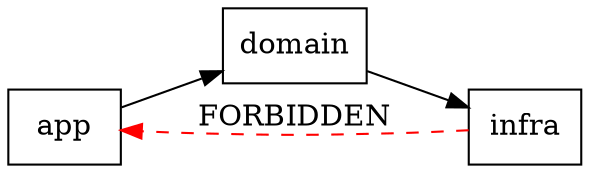

适合挂在 CI：生成依赖 `.dot`，人工或脚本检查是否出现红色边。

### 1.3.4 无向图与布局引擎

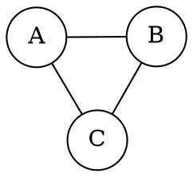

| 引擎 | 适合 |
|------|------|
| `dot` | 有向层级（默认，架构/依赖首选） |
| `neato` / `fdp` | 无向网络、力导向 |
| `circo` | 环状 |
| `twopi` | 径向 |

### 1.3.5 常用 DOT 属性速查

| 属性 | 位置 | 作用 |
|------|------|------|
| `rankdir=LR/TB` | graph | 主方向 |
| `shape=box/ellipse/cylinder` | node | 节点外形 |
| `style=filled,dashed` | node/edge | 填充/虚线 |
| `label="…"` | 任意 | 显示文字（ID 可保持英文） |
| `constraint=false` | edge | 不参与排层，减少交叉 |
| `rank=same` | 匿名 subgraph | 强制同层 |

## 1.4 PlantUML 基础与常用图

所有图外层统一：


### 1.4.1 时序图（Sequence）— 请求链路

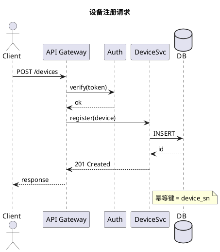

适用：接口联调说明、跨进程调用、超时/重试插入 `...` 与 `alt/else`。

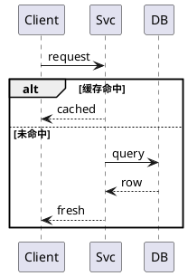

### 1.4.2 类图（Class）— 接口与实现

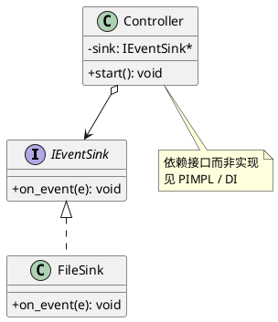

适用：模块边界、策略模式、[[D-系统与架构/02.软件架构设计/1. PIMPL设计|PIMPL]] 对外暴露的纯接口。

### 1.4.3 组件图（Component）— 系统架构

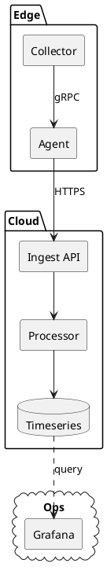

适用：知识库里的「系统一页纸」架构、服务边界评审。

### 1.4.4 活动图（Activity）— 业务流程

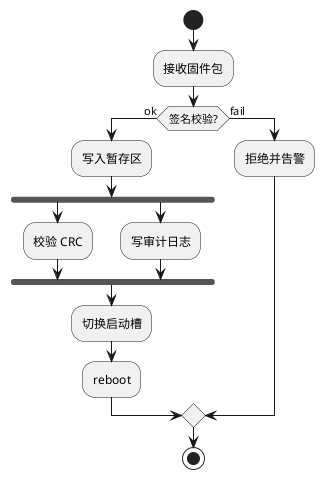

适用：升级流程、CI 流水线、带分支/并行的业务步骤。

### 1.4.5 状态图（State）— 生命周期

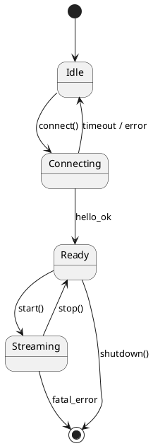

适用：连接状态机、设备工作模式、协议会话。

### 1.4.6 部署图（Deployment）— 跑在哪

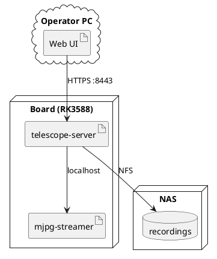

适用：嵌入式 + 上位机拓扑、容器/主机落点（可对照 [[C-Linux生态/03.Linux开发/1. 讯为RK3588|RK3588]] 类板端笔记）。

### 1.4.7 用例图（Use Case）— 角色边界

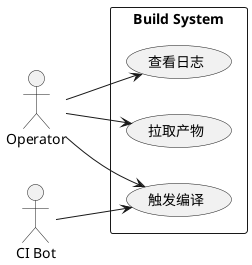

适用：需求澄清、权限边界，不宜画太细（细交互改时序图）。

## 1.5 知识库落地约定（本 vault）

1. **主题决定位置**：标记语言/语法说明放 `G-语言与标记/`；某子系统的具体架构图放在对应模块笔记旁或 `docs/diagrams/`（项目内）。
2. **嵌入笔记**：需要静态展示时导出 PNG 到 `picture/`，写法：

```markdown

```

3. **源码块语言标签**：DOT 用 `dot`，PlantUML 用 `plantuml`（小写，与 vault 代码块规范一致）。
4. **一图一职责**：依赖图不要塞时序细节；时序图不要画全量类字段。
5. **稳定 ID**：节点/参与者用英文 ID，`label`/`as` 写中文显示名，避免重命名时全文替换困难。
6. **与结构化设计联动**：模块依赖、循环依赖检测优先 DOT；接口隔离与调用链说明用 PlantUML class/sequence。见 [[D-系统与架构/02.软件架构设计/2. 结构化设计|结构化设计]]。

## 1.6 最小「架构三件套」模板

新建子系统文档时，建议固定三张图：

| 序号 | 文件 | 类型 | 回答的问题 |
|------|------|------|------------|
| 1 | `deps.dot` | DOT digraph | 模块谁依赖谁？有无反向依赖？ |
| 2 | `context.puml` | PlantUML component | 系统边界与外部系统？ |
| 3 | `happy-path.puml` | PlantUML sequence | 主路径一次请求怎么走？ |

按需追加：`states.puml`（生命周期）、`deploy.puml`（部署）。

### deps.dot 骨架

> 不要留「空 digraph」：没有任何边时 `dot` 仍会成功，但输出接近空白，Obsidian 预览会像渲染失败。骨架里先放最小可运行边，再改成真实模块名。


### context.puml 骨架

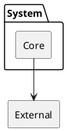

### happy-path.puml 骨架

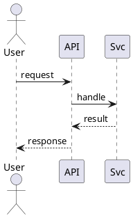

## 1.7 常见坑

| 现象 | 原因 | 处理 |
|------|------|------|
| DOT cluster 不画框 | subgraph 名未以 `cluster_` 开头 | 改名 `cluster_xxx` |
| 中文方框 / 乱码 | 未指定含 CJK 的字体，或 DOT 未设 UTF-8 | 见下方「中文字体」 |
| PlantUML 字体名无效 | 带空格未加引号，如 `Microsoft YaHei` | 写成 `"Microsoft YaHei UI"` |
| PlantUML 不渲染 | 无 Java / 本地服务未开 | 装 JRE，或起本地 `--http-server` |
| 图交叉严重 | 节点过多、方向不当 | `rankdir`、拆图、`constraint=false` |
| Git diff 噪声 | 每次重排 PNG | PNG 可忽略或按需生成；源文件必提交 |
| 时序图过长 | 参与者过多 | 拆成「网关内」「服务内」多张 |

### 中文字体（Windows / Linux）

要点：

1. **字体名必须是本机已安装的 family 名**（设置 → 字体 里看；不要写盘符路径）
2. **PlantUML**：名字含空格时必须加双引号；只写 `Microsoft YaHei` 不带引号容易解析错
3. **DOT**：同时设 `charset="UTF-8"`，并对 `graph` / `node` / `edge` 都指定 `fontname`
4. 本机常见可用名：Windows → `"Microsoft YaHei UI"` / `"Noto Sans SC"`；Linux → `"Noto Sans CJK SC"`

PlantUML 完整示例（推荐）：

```plantuml
@startuml
skinparam defaultFontName "Microsoft YaHei UI"
skinparam defaultFontSize 14
' 备选: "Noto Sans SC"  |  Linux: "Noto Sans CJK SC"

Alice -> Bob: 你好
Bob --> Alice: 收到

@enduml
```

也可用中文族名（若系统已注册为「微软雅黑」）：

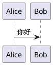

DOT 完整示例：

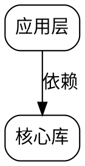

导出命令（源文件请存 UTF-8）：

```bash
dot -Tpng deps-zh.dot -o picture/deps-zh.png
dot -Tsvg deps-zh.dot -o picture/deps-zh.svg
```

## 1.8 与 Markdown 的配合

在 [[G-语言与标记/1. Markdown|Markdown]] 笔记中：

- 讲解语法/模板：直接放 ` ```dot ` / ` ```plantuml ` 源码（可复制）
- 需要「打开即见」：导出 PNG + ``
- 勿在表格单元格内写带 `|` 别名的 wikilink

## 1.9 相关笔记

- [[G-语言与标记/1. Markdown|Markdown 语法]] — 笔记嵌入与图片路径
- [[D-系统与架构/02.软件架构设计/2. 结构化设计|结构化设计]] — 依赖规则与 Graphviz 检测
- [[D-系统与架构/02.软件架构设计/1. PIMPL设计|PIMPL]] — 类图中的接口隔离
- [[E-AI与Agent协同开发/02.工作流与方法论/4. 遗留代码系统分析与重构|遗留代码分析]] — 脉络梳理可配合 Graphviz
