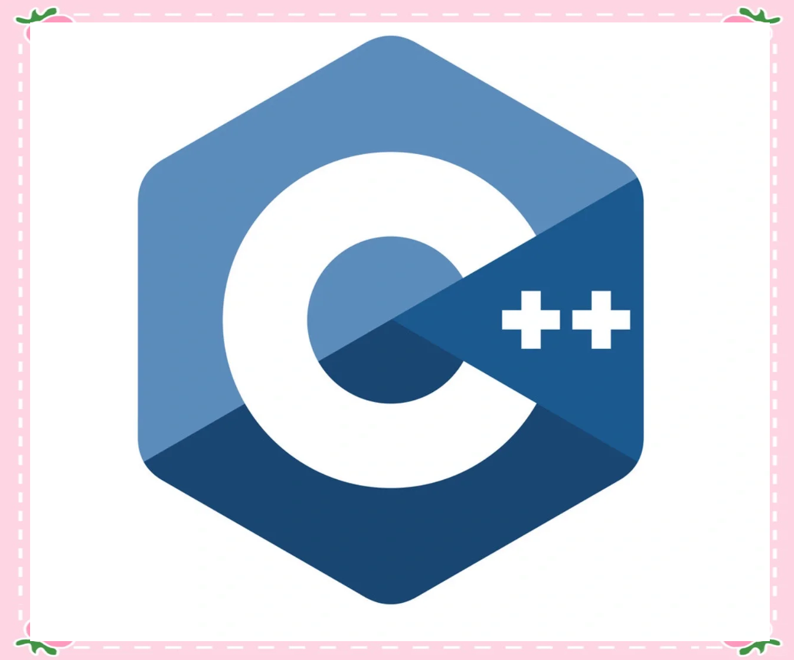

<p align="center">
  
</p>

<h1 align="center">📚 C/C++ Systems Programming Knowledge Base</h1>

<p align="center">
  
  
  
  
  
  
  
  
</p>

<p align="center">
  <a href="../README.md"></a>
</p>

---

## 📖 About

This is a **personal study notes knowledge base** focused on C/C++ systems programming, Linux environment, computer architecture, and related engineering topics. All notes are written in **Markdown** and managed via **Obsidian**.

> 🎯 **Goal**: Build a searchable, reviewable systems programming knowledge system covering the full spectrum from low-level principles to engineering practices.

## ✨ Topics

| 🖥️ **C/C++** | 🐧 **Linux Env** | ⚙️ **Architecture** |
|:---:|:---:|:---:|
| Grammar · Templates · Coding Standards · Project Structure | Vim · g++/gdb · Makefile · Kernel Modules | ARM32/64 · X86 ASM · Memory Model |

| 🛠️ **Dev Tools & Build** | 🌐 **Networking** | 📱 **Embedded MCU** |
|:---:|:---:|:---:|
| CLion · VS2022 · CMake (Beginner→Advanced) | Muduo Library · IO Models | Boot-App Mode · UART Memory Injection |

| 🤖 **AI-Assisted Dev** | 📝 **Book Notes** | 🎯 **More Topics** |
|:---:|:---:|:---:|
| Paradigm Evolution · Vibecoding · Agent Workflows | C++ Best Practices · Open Source Analysis | GC · Profiling (8) · Architecture (5) · Concurrency |

## 📂 Directory Layout

```
📦 obsidian_files
├── 📁 A-编程语言/              # Languages
│   ├── 📁 01.C语言/           # C · low-level · system programming
│   ├── 📁 02.C++/             # C++ syntax · standards · templates · More Effective C++
│   └── 📁 03.Golang/          # Go basics
├── 📁 B-构建与脚本/            # Build & scripting
│   ├── 📁 01.构建工具/         # g++ · Makefile · CMake · build scripts
│   └── 📁 02.脚本语言/         # Shell · Lua · Python
├── 📁 C-Linux生态/             # Linux ecosystem
│   ├── 📁 01.Linux环境/        # vim · commands · dynamic libs · rpath · dlopen/hijack · grep
│   ├── 📁 02.Linux系统编程/     # processes · kernel · drivers
│   ├── 📁 03.Linux开发/        # RK3588 · Yocto · cross compilation
│   ├── 📁 04.调试与优化/       # gdb · coredump · perf · file IO · branch opt
│   ├── 📁 05.网络编程/         # Muduo · IO models
│   └── 📁 06.开源项目分析/     # Muduo/LevelDB/Redis/Nginx
├── 📁 D-系统与架构/            # Systems & architecture
│   ├── 📁 01.架构体系/         # ARM vs X86
│   ├── 📁 02.软件架构设计/     # PIMPL · CLI · methodology · plugin architecture
│   ├── 📁 03.并发与内存/       # GC · atomic · threads & async
│   └── 📁 04.MCU嵌入式/        # MCU · ARM32 memory injection
├── 📁 E-AI与Agent协同开发/     # AI-assisted development
│   ├── 📁 01.基础概念/         # Paradigm evolution
│   ├── 📁 02.工作流与方法论/   # Vibecoding · Super Programmer roadmap · context management · legacy code analysis
│   ├── 📁 03.工具与配置/       # 🚧 TBD
│   └── 📁 04.最佳实践/         # 🚧 TBD
├── 📁 F-杂项/                 # Tools & misc
│   ├── 📁 01.开发工具/         # MobaXterm · CLion · VS2022 · Qt
│   ├── 📁 02.版本管理/         # Git · log conventions
│   ├── 📁 03.数据库/           # 🚧 WIP
│   ├── 📁 04.语言与标记/       # Markdown · XML · CSS · PlantUML · English
│   └── 📁 05.杂项/             # 🚧 Empty (content relocated to topic dirs)
├── 📁 picture/                  # Image assets
├── 📁 readme/                   # Multi-language README
├── 📁 .claude/                  # Claude Code config
└── 📄 CLAUDE.md                 # AI assistant config
```

## 🚀 Getting Started

```bash
# Clone the repo
git clone git@github.com:xixishuibubao/obsidian_CPP.git

# Open as Obsidian vault
# Obsidian → Open another vault → Select this directory

# Pull latest changes
git pull origin main
```

## 📜 Git Workflow

This repository follows [Conventional Commits](https://www.conventionalcommits.org/) for commit messages:

| Type       | Usage                  |
|------------|------------------------|
| `feat`     | New content / feature  |
| `fix`      | Bug / error fix        |
| `docs`     | Documentation          |
| `style`    | Formatting, naming     |
| `refactor` | Restructuring          |
| `chore`    | Tooling, config        |

Local commits are squashed before pushing to remote to maintain a clean history.

## 📄 License

MIT © xixishuibubao77
